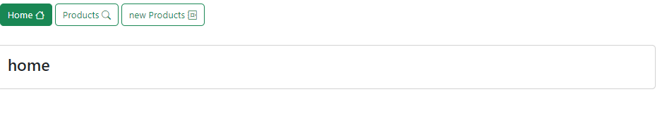
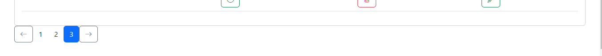
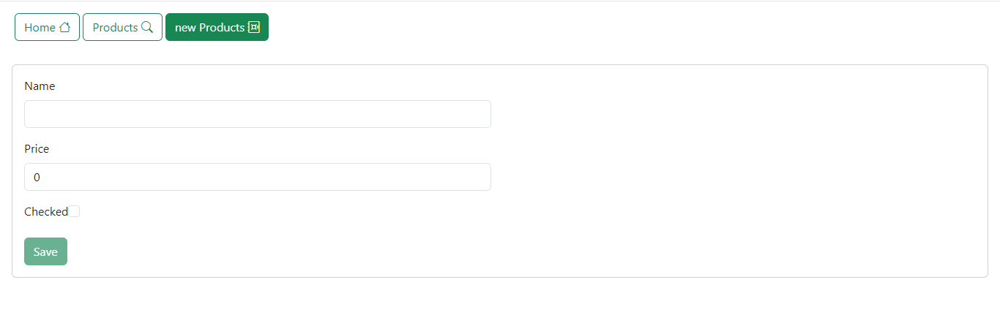
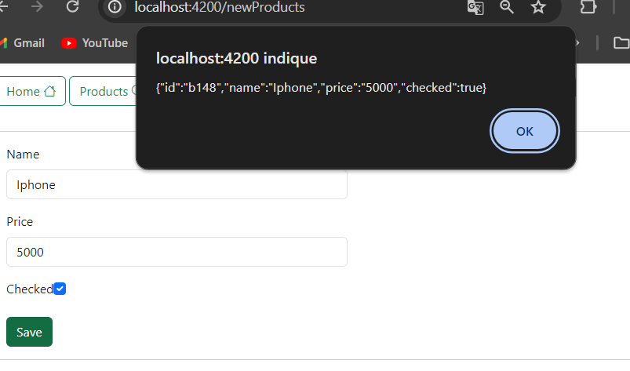
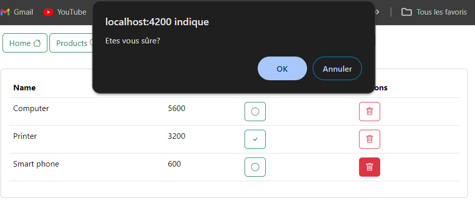

# Getion de pruid avec angular
Application de gestion de produit unissant un serveur un backend basé sur Json-server

# Données json utilisées pour le backend

# Page d'acceuil

# Liste des produits

# Pagination des produis

# Formulaire pour ajouter et modifier des produits

# Confirmation d'ajout

# Supression de produit

